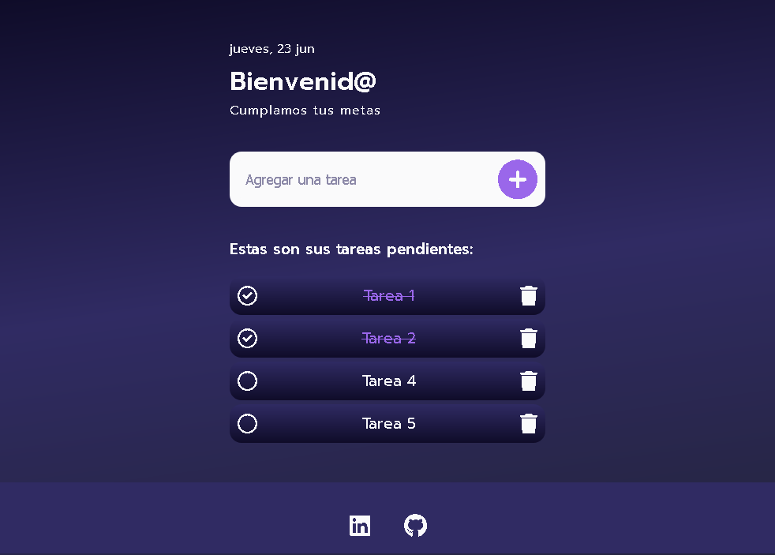

# App Tareas pendientes
Aplicación básica de listado de tareas pendientes utilizando JavaScript

  <h3>
    <a href="https://morlabdev.github.io/JS_appTareas/" target="_blank">Probar app</a>
     | 
    <a href="https://www.linkedin.com/in/israelmorenolabrador/"  target="_blank">Feedback</a>
  </h3>

# Vista previa
<h3>Pantalla inicial</h3>

